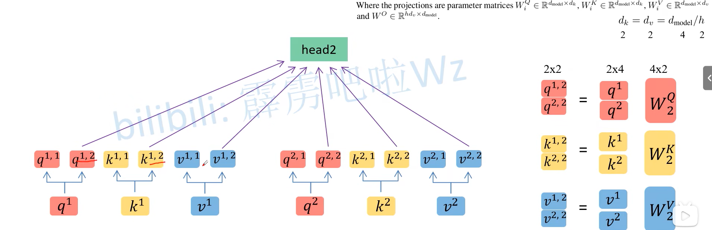

# transform

结构图中左边是编码器右边是解码器

注意力机制与编码解码之间的关系就如同显卡与冯诺伊曼架构，显卡是在冯诺伊曼大框架下做出的准对性的优化，但本质依旧是大框架

编码与解码是为了在rnn使输入与输入的语句一样长以对应，tansformer相当于另起炉灶，做了相当于cnn与rnn的结构，并保留了编码与解码

码其实就是去除掉如同发音，书写，而剩下来的单纯语义关系，如同香蕉这个词是人为的汉字，外国是英语，但在自然界中他是一个甜甜的，长条形的一个物质，这就是语义

所以在计算机中进行的编码，应当能够含有语义关系,如以向量表示猴子与香蕉时，其值应当相差较小

以上所诉的给语义单元初始化，中的语义单元就是token,初始化的方式如标记器与独热编码

- 标记器相当于在一个数轴上不能有效的表达关系
- 独热编码的维度过高，只以维度为关系


编码也就相当于将token转化为语义，存在潜空间（一系列的数学计算）中，之后由解码对潜空间中的语义进行转化，如使用独热码对token进行语义转化。相当于曹冲称象

图中不同维度值代表其一个基本语义


**embedding层代替独热编码**

**一个图片一个嵌入，通常是一行代表一个图片**

但标记器与独热编码都具有缺点那我们此时应该怎么做呢？这时，**Embedding层**就出现了假设：我们有一个2 x 6的矩阵，然后乘上一个6 x 3的矩阵后，变成了一个2 x 3的矩阵。


Embedding层，在某种程度上，就是用来降维的，降维的原理就是**矩阵乘法**。这就是嵌入层的一个作用——**降维**。

但**距离的远近会影响我们的观察效果**。低维的数据可能包含的特征是非常**笼统**的，我们需要不停地拉近拉远来改变我们的感受，让我们对这幅图有不同的观察点，找出我们要的"**茬**"。Embedding的又一个作用体现了：**对低维的数据进行升维时，可能把一些其他特征给放大了，或者把笼统的特征给分开了**。

同时，这个Embedding是一直在学习在优化的，就使得整个拉近拉远的过程慢慢形成一个良好的观察点。

- **注意：不会使用独热码进行初始化，而是直接映射到一个表中**

  - 首先，需要构建一个词汇表。词汇表是一个映射，将每个唯一的词（或词语）与一个唯一的整数索引相关联。

  - ```
    {
        "hello": 0,
        "world": 1,
        "this": 2,
        "is": 3,
        "a": 4,
        "test": 5
    }
    ```

    输入的句子会被转换为对应的索引。例如，句子 "hello world" 可以被转换为索引序列 `[0, 1]`。

    再使用嵌入

    ```
    Embedding Matrix:
    [
        [0.1, 0.2, 0.3, 0.4],  # "hello"
        [0.5, 0.6, 0.7, 0.8],  # "world"
        [0.9, 0.1, 0.2, 0.3],  # "this"
        [0.4, 0.5, 0.6, 0.7],  # "is"
        [0.8, 0.9, 0.1, 0.2],  # "a"
        [0.3, 0.4, 0.5, 0.6]   # "test"
    ]
    ```


**ps:Token 是文本数据的一个基本单元，可以是一个词、一个子词、一个字符，甚至是一个标点符号，具体取决于分词方法。**

**自注意力**相当于可以将输入多个的token进行语义上的组合，如输入多个词，以注意力机制输出带有语气的组合翻译，词嵌入已经解决了单个词的语义问题，而自注意力可以解决词在整体上的语义问题

此时的输入一般是多个词，且这些词进行矩阵/向量连接

现在有点火热了，selft_attention进一步说是可以解决客观与主观的上下文语义，因为一句话在不同上下文中可以有不同的语义，使得生成的语句更加符合语义

1. 下图，Din则是输入单词**标记器或独热编码的矩阵**，之后会使用词嵌入将他生成一个新的矩阵，这里的第二层三个矩阵都是相同的，输入到这里都还没进行自注意力
2. 在之后与不同的三个W生成QKV(行数与输入函数一致)，QK^T^相乘生成一个A（这里相当于q上的每一行，都会与k的每一列进行**scaled inner product**，相当于一个词的Q得行会与每一个词的K进行attenton,attention就是匹配这2个向量有多接近)这时的A中的每一行就相当于每一个词由所有词对当前位置的的分，之后的softmax函数只不过是改变了大小但比例不变
3. 再对A进行相除操作及对每一行进行softmax（这个softmax分数决定了每个单词对编码当下位置的贡献),每一行的softmax对应着每一个词的贡献
4. 1. softmax操作，随着模型处理输入序列的每个单词，自注意力会关注整个输入序列的所有单词，帮助模型对本单词更好地进行编码。
   2. **这时的A`就相当于对客观语义V的微调参数，使V客观语义具有主观语义**
   3. 思考：为什么不直接使用一个矩阵代替QK进行计算？一个矩阵类似于线性操作，而了两个矩阵相乘相当于引入了非线性，使得能更适应复杂环境
   4. A*V如果分开观察就可以发现，是A1i\*Vi1
   5. 在代码中实际


**自注意力精读：**

这里以一个词得q与所词得k进行运算，得出这个词得位置得分,矩阵运算就相当于是多次向量的集合运算


**将上一步得分与所有位置的v进行向量运算，相当于对当前位置进行调整，得到一个符合主观事实的矩阵，也就是一个通过注意力加工过的矩阵，但依旧反应的是词的特征，这个矩阵中的每一行表示经过自注意力机制加权后的词表示。通过这种机制，特征维度保持不变（仍为 d*d*），使得自注意力模块可以无缝集成到更深的网络中。**如果想输出一个特定的词还需要通过一个head。

注意：q代表条件，k奉献自己，v代表自己


**交叉注意力**其实和自注意力一样都是和注意力一样的计算步骤，都是q,k,v，但q,k,v的来源不同，自注意力的q.k，v都来自于自己的数据产生也就是上图步骤，而，交叉注意力的q,k与v来源不同，以解码器举例，解码器中的第二步多注意力机制中的q,k来源于编码器中的最终输出所产生的q,k，而v来源于输入的token.

**多头注意力**机制基于注意力机制，是一个词产生多个多个头，以前是q,现在q1,q2,q3…….计算过程不变。

以下为训练过程，输入编码与解码值，编码器会将之后的潜空间的值传进解码器中，解码器也会生成潜空间，然后这两个潜空间进行回归函数，再反向传播


以下是测试部分，可知翻译时大多数不是一个单词对应一个单词，模型在测试时会在解码器部分输入一个起始符，后传进编码器中的潜空间，此时会一起进行softmax函数最后输出对每一个单词的概率并将其拿出，后这时的输出值会像rnn网络一样跟随着之后共同进入下一层，在softmax中有结束语句的判断，所以最后输出的是结束字符，这样就实现非字符对应，而是一定的自我意识


PositionalEncoding位置编码，使token共同传入进行并行运算时存在语义中的位置信息。

进行解决的方法有两种，进行将位置信息方向在权重矩阵中，将位置信息放在偏执矩阵中，由于后一种对于其他语义影响更少所以在这里使用


**自注意力层的完善——“多头”注意力机制**：

有多个查询/键/值权重矩阵集合，（Transformer使用八个注意力头）并且每一个都是随机初始化的。和上边一样，用矩阵X乘以WQ、WK、WV来产生查询、键、值矩阵。
	self-attention只是使用了一组WQ、WK、WV来进行变换得到查询、键、值矩阵，而Multi-Head Attention使用多组WQ，WK，WV得到多组查询、键、值矩阵，然后每组分别计算得到一个Z矩阵。


有几个头就会将维度进行均匀拆分


将不同head进行分别的自注意力计算




神经网络降维可以抽象，升维可以分类


使用transform替代一部分cnn网络进行特征提取可以多模态，与特征融合，但cnn有更强的性能

**在实际运行中transformer代替的原始数据的输入部分，业就是编码与解码部分，无论是自然语言还是图像，而注意力机制只是其一种实现方式**

所有Encoder中结构是相同的但是参数是不同的，之后也是会对这些参数进行训练


#### **tansformer框架完整实现：**

五个class:transform block——1

​		encoder——2

​		decoder block——3

​		decoder——4

​		transformer——5

​		attention——6

1:进行自注意多头注意，会进行残差相加，ADD后进行Norm归一化，后进行前向传播，再次相加

2:循环进行1,有部分维度变化之间的维护

3:类似于1的过程，只不过此时的q,k不再变化一只是编码器的输出，v是输入会随着循环改变。

4：循环3的过程，并且在3之前会有一层带有mask的自注意力，mask用于防止预测被预测值所影响。且这时的输入还会带有每次的输出结果

5:所有以上就形成了一个完整的transformer，进行反向传播

6：注意力机制的执行

- 注意：
  - softmax输出的是每一个词的出概率，假如有1000个词，那么就会生成1000个神经元每一个神经元的输出就是当前词的输出概率
  - 
  - **解码器的输入由于会随着解码器的输出而发生改变，所以一开始会有有个空的token进行占位，也就是说token的数量也是固定的，但会有空的，所以这时的掩码器就是会将无数据的空token改为一个特别小的值防止对预测产生影响。这只是对数据的一步处理，处理完后的token进行自注意力**


#### **再次理解**

注意力就是一个有限的资源，要分配给所有的输入不同的关注程度，这也就一个权重分配的事，权重的分配是模型习得的事，这最后是一个结果。


这里是没有使用编码的，通过常识的进行解释注意力机制

当存在一幅图，我们给出以上单词我们的关注得分为K,这时就是第一眼的关注程度得分，得分越高表示我们关注越高

而此时我们给出一个**关注事物，Q，**那么我们的注意力就会发生改变，每个事物改变后的得分变为alpa,计算方式为**Q*K**，**这就是权重**，这里的q也就是在以后的**解码器输入token**,Q相当条件的输入,我们会把已有的单词也就是每次的输出**作为条件进行传入**

**相当于Q,k进行的是当前词的注意力得分情况**

**这时我们将每一个词进行编码就成为了V,这时我们的V*alpa就不再是得分而是一个结果,这里虽然是一个值，但在矩阵计算时的结果是一个矩阵对应着在当前条件下的各个token的注意力,不会将所有的结果进行相加，停在alpa*V**


**这里进行的就是交叉注意力机制的表达**

这里的x已经是经过词嵌入的矩阵，我们将原数据的嵌入矩阵x进行全矩阵连接输出v,k,对于条件的嵌入矩阵x进行全连接输出q

之后我们再大概进行上上幅图的计算，alpa=k*q计算出当前词的注意力得分，再与原v进行相乘alpa\*v计算出结果

当进过这样的计算后输出的一个词，再将这个词的x进行全连接算出q作为下一词的条件传入，再进行之前的过程

**那自注意力机制呢**

自注意力机制的不会有单独的要求也就是条件进行传入，此时的条件就是他们各自，所以此时的每一个词还需要有一个q值作为其他词的条件，也就是这个整个流程的注意力条件，所以成为自注意力机制


**位置编码：**

**ps:向量的维度定义与张量的不同，向量是列数且只有一行，而张量才考虑列及其他的维度**


**掩码：**

在处理自然语言处理（NLP）任务时，源序列（例如句子、段落或文档）的长度通常是不一致的。这意味着每个输入序列可能包含不同数量的词汇、字符或标记。例如：

- 一个句子可能有5个单词，另一个句子可能有10个单词，甚至更长。
- 在机器翻译中，一个源语言的句子长度可能与目标语言的句子长度不相同。

由于神经网络（特别是循环神经网络 RNN 和 Transformer）要求每批次中的输入序列具有相同的长度，处理变长序列时通常会遇到问题。因此，需要对源序列进行填充（padding），以确保它们具有相同的长度。这种填充操作将较短的序列通过添加额外的“填充标记”（例如 `<PAD>`）来补齐，使所有序列的长度一致

假设我们有以下两个句子：

- 句子 1: "I am happy"
- 句子 2: "I feel very happy today"

其中，句子 1 包含 3 个单词，而句子 2 包含 5 个单词。如果我们将这两个句子放在同一个批次中，它们的长度不一致，可能会导致处理上的问题。为了解决这个问题，我们需要将这两个句子补齐成相同的长度。

- 句子 1 的掩码: `[1, 1, 1, 0, 0]`
- 句子 2 的掩码: `[1, 1, 1, 1, 1]`


